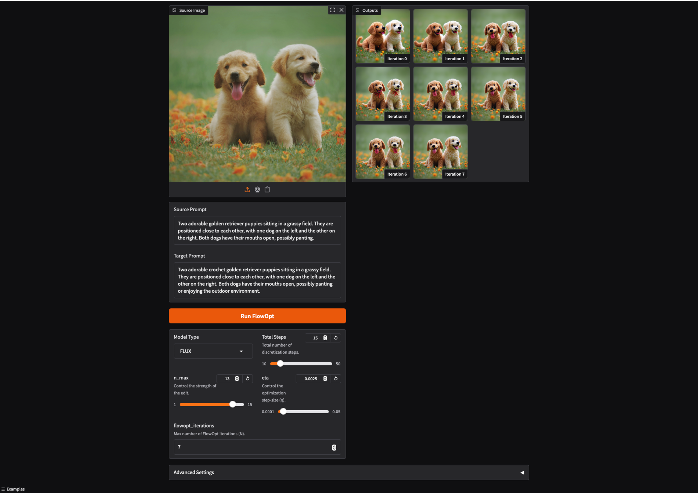

[]([https://github.com/topics/video-editing](https://github.com/topics/text-guided-image-editing))
[](https://www.python.org/downloads/release/python-3810/)
[](https://pytorch.org/)
[](https://pypi.org/project/matplotlib/3.7.1)


# FlowOpt

[Project](https://orronai.github.io/FlowOpt/) | [Arxiv](https://arxiv.org/abs/2510.22010) | [Demo](https://huggingface.co/spaces/orronai/FlowOpt)

### Official PyTorch implementation of the paper: "FlowOpt: Fast Optimization Through Whole Flow Processes For Training-Free Editing"


## Installation
#### 1. Clone the repo

```bash
git clone https://github.com/orronai/FlowOpt.git
cd FlowOpt
```

#### 2. Install the required environment

```bash
python -m pip install -r requirements.txt
```

## Usage Example
#### A. Inversion

Replace `<MODEL>` with either `FLUX` or `SD3`:

```bash
python FlowOpt.py --exp_yaml yaml_files/<MODEL>_inversion_exp.yaml
```

#### B. Editing

Replace `<MODEL>` with either `FLUX` or `SD3`:

```bash
python FlowOpt.py --exp_yaml yaml_files/<MODEL>_editing_exp.yaml
```

## Usage &mdash; Your Own Examples

* Upload images to `dataset` folder.

* Create an edits file that specifies: (a) a path to the input image, (b) a source prompt, (c) target prompts, and (d) target codes. The target codes summarize the changes between the source and target prompts and will appear in the output filename.<br>
See `yaml_files/edits.yaml` for example.

* Create an experiment file containing the hyperparamaters needed for running FlowOpt, such as `T_steps`, `n_max`, `max_iterations` and `eta`. For an editing experiment, set the variable `inversion` to `false` and for inversion experiment set it to `true`. This file also includes the path to the `yaml_files/edits.yaml` file.<br>
See `yaml_files/<MODEL>_editing_exp.yaml` for `FLUX`|`SD3` editing usage example, and `yaml_files/<MODEL>_inversion_exp.yaml` for `FLUX`|`SD3` inversion usage example.<br>
    * The provided hyperparameters has been evaluated for images of dimension `1024x1024`.

* Run FlowOpt:

```bash
python FlowOpt.py --exp_yaml <path_to_your_experiment_yaml>
```

## Gradio GUI

For easy image editing you can also use gradio GUI.

* Install gradio library:

```bash
pip install gradio
```

* Run FlowOpt gradio (examples are included in the demo):

```bash
python FlowOpt_gradio.py
```




## License
This project is licensed under the [MIT License](LICENSE).

## Citation
If you use this code for your research, please cite our paper:

```
@article{ronai2025flowopt,
	title={FlowOpt: Fast Optimization Through Whole Flow Processes for Training-Free Editing},
	author={Ronai, Or and Kulikov, Vladimir, and Michaeli, Tomer},
	journal={arXiv preprint arXiv:2510.22010},
	year={2025}
}
```
